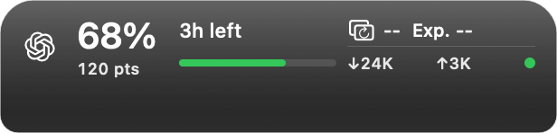

# Usage Topbar

**English** · [简体中文](README.md)

A lightweight, liquid-glass-style companion for Apple Silicon Macs. Keep Codex remaining usage, its limiting window, reset countdown, points, and whole-Mac throughput at the window edge and in the menu bar.

**Current version: 0.4.0 (build 20) · Apple Silicon (arm64) · macOS 13+**

[Download DMG](https://github.com/ALEXESLAT/usage-topbar/releases/download/v0.4.0/UsageTopbar-0.4.0-macOS-arm64.dmg) · [Download ZIP](https://github.com/ALEXESLAT/usage-topbar/releases/download/v0.4.0/UsageTopbar-0.4.0-macOS-arm64.zip) · [Release](https://github.com/ALEXESLAT/usage-topbar/releases/tag/v0.4.0) · [Installation and usage](docs/USAGE.en.md) · [Changelog](CHANGELOG.en.md) · [Report a problem](https://github.com/ALEXESLAT/usage-topbar/issues)

*Rendered with the actual 0.4.0 UI components, simulated data, and a static dark background; live Liquid Glass refraction is not shown.*

## Features

- Codex remaining usage, limiting window, reset countdown, and points.
- An overlay following the foreground Codex/ChatGPT window, with menu-bar refresh, visibility, and quit controls.
- Whole-Mac upload/download rates. Unknown usage shows `--%`; a valid zero shows `0%`.
- Native Liquid Glass on macOS 26+, with SwiftUI material on earlier systems.

## New in 0.4.0

- Compact overlay with a centered percentage, pts aligned to its actual left edge, card details above throughput, and a Codex menu-bar mark.
- Countdown follows the actual reset deadline; available reset-card count and earliest expiry use `Exp. MM/dd`, with `--` for unavailable details.
- Initial reads and recovery animate digits and bar together from zero to the actual value over about 0.8 seconds with ease-out. Routine refreshes do not replay it; reduced motion is respected.
- Monitoring starts directly within the disclosed scope, without a per-launch dialog. Optional launch at login defaults off for new users and preserves existing system registration.
- Background and manually hidden tracking checks fall back to one second; foreground and automatic hiding retain 0.2-second checks with immediate event handling. Presentation deduplication and font measurement caching avoid repeated work.

## Get started

1. Use an Apple Silicon Mac (macOS 13+) with a signed-in Codex/ChatGPT desktop app providing app-server.
2. Download the DMG and drag the app to Applications. Quit the previous version before updating.
3. Open the app to start monitoring the documented data immediately, without an extra launch confirmation or API key entry.

This release is **ad-hoc signed and not notarized by Apple**. macOS may block the first launch; see [installation, checksums, and troubleshooting](docs/USAGE.en.md). Intel Macs are unsupported.

## More

[Usage and privacy](docs/USAGE.en.md) · [Development and contributions](CONTRIBUTING.en.md) · [Release notes](RELEASE_NOTES.en.md) · [Automated checks](https://github.com/ALEXESLAT/usage-topbar/actions/workflows/ci.yml)

Usage is read from OpenAI through the local Codex app-server. Interface statistics and window handling stay on the Mac. The app itself does not store usage or credentials; see the guide for the complete data scope.

Local mock regressions, builds, and renders have been checked. Older systems, physical multi-display/notch setups, and prolonged real-account use remain untested on devices. Licensed under the [MIT License](LICENSE). Copyright © 2026 ALEXESLAT.

> The software and documentation were written by artificial intelligence.
