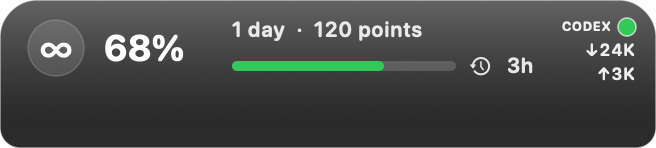

# Usage Topbar

**简体中文** · [English](README.en.md)

为 Apple Silicon Mac 打造的液态玻璃风格轻量工具：把 Codex 剩余额度、周期、重置倒计时、points 和整机网速放在窗口边缘与菜单栏。

**当前版本：0.3.1（build 19） · Apple Silicon（arm64） · macOS 13+**

[下载 DMG](https://github.com/ALEXESLAT/usage-topbar/releases/download/v0.3.1/UsageTopbar-0.3.1-macOS-arm64.dmg) · [下载 ZIP](https://github.com/ALEXESLAT/usage-topbar/releases/download/v0.3.1/UsageTopbar-0.3.1-macOS-arm64.zip) · [发布页](https://github.com/ALEXESLAT/usage-topbar/releases/tag/v0.3.1) · [安装与使用](docs/USAGE.md) · [更新记录](CHANGELOG.md) · [问题反馈](https://github.com/ALEXESLAT/usage-topbar/issues)

*由 0.3.1 实际界面组件渲染，使用模拟数据和静态深色背景；不展示实时 Liquid Glass 折射。*

## 功能

- 显示 Codex 剩余额度、最受限周期、重置倒计时和 points。
- 浮层跟随前台 Codex/ChatGPT 窗口；菜单栏可刷新、隐藏或退出。
- 显示整机上下行速率。未知额度显示 `--%`，有效零值显示 `0%`。
- macOS 26+ 使用原生 Liquid Glass，较早系统使用 SwiftUI 材质。

## 开始使用

1. 使用 Apple Silicon Mac（macOS 13+），安装并登录提供 app-server 的 Codex/ChatGPT 桌面应用。
2. 下载 DMG，将应用拖入“应用程序”；更新前先退出旧版。
3. 打开应用，阅读数据说明并选择“启动”。无需输入 API key。

当前版本为 **ad-hoc 签名，未经过 Apple 公证**。首次打开可能被系统拦截；详见[安装、校验与故障排查](docs/USAGE.md)。不支持 Intel Mac。

## 了解更多

[使用与隐私](docs/USAGE.md) · [开发与贡献](CONTRIBUTING.md) · [发布说明](RELEASE_NOTES.md) · [自动检查](https://github.com/ALEXESLAT/usage-topbar/actions/workflows/ci.yml)

通过本地 Codex app-server 向 OpenAI 读取用量；网卡统计和窗口处理在本机完成。应用自身不保存用量或凭据，详细数据范围见使用指南。

已完成本机模拟回归、构建与渲染；旧系统、物理多屏/刘海组合和真实账户长时间运行尚未实机覆盖。采用 [MIT 许可证](LICENSE)，版权署名 © 2026 ALEXESLAT。

> 本程序及文档由人工智能编写。
